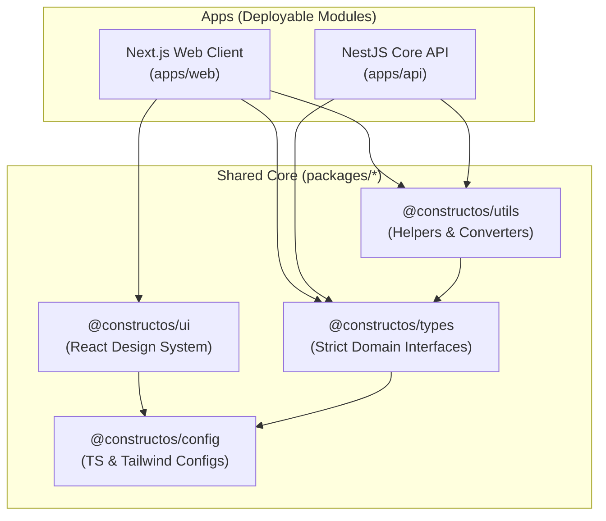
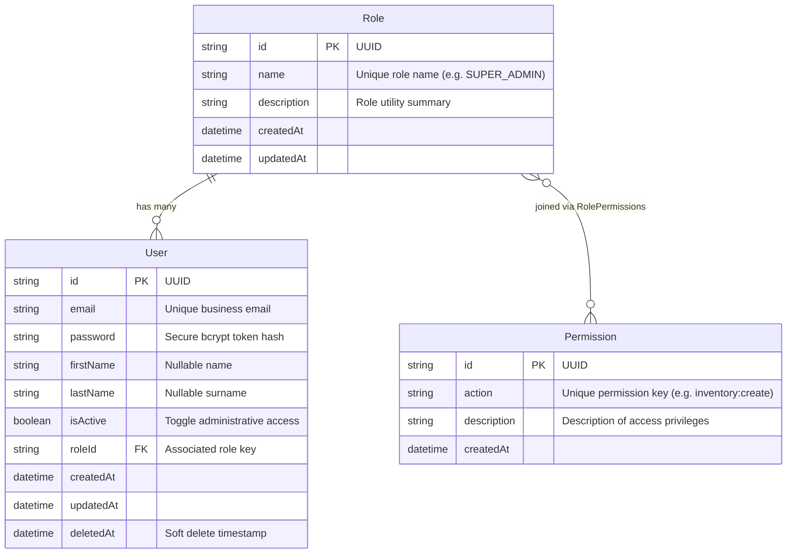
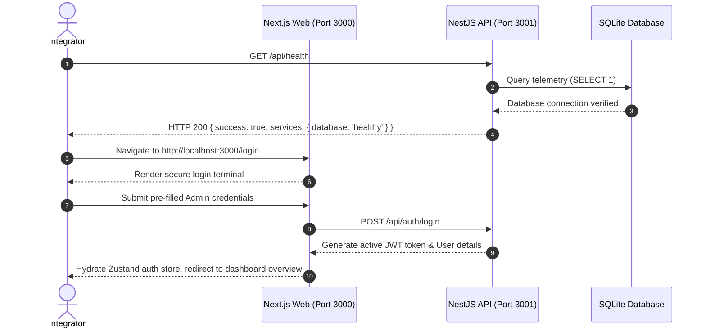

# ConstructOS Core Architecture Specification

This document establishes the production-grade architectural foundation for **ConstructOS**, a modern industrial operating system that unifies contractor ERP, logistics telemetry, B2B procurement marketplace, and milestone escrows billing.

---

## 🏗️ 1. Workspace Monorepo Topography

ConstructOS leverages a robust Turborepo workspace configuration designed to maximize speed, cache compilation outputs, and maintain dry, clean engineering lines between packages.



---

## 🔒 2. Authentication & Guard Mappings

ConstructOS features a fully integrated **Role-Based Access Control (RBAC)** architecture operating synchronously across the client and api gateways.

### RBAC Security Matrix

| Role                    | Hierarchy / Description                    | Key System Permissions                                   |
| :---------------------- | :----------------------------------------- | :------------------------------------------------------- |
| **`SUPER_ADMIN`**       | Complete system bypass capability          | All permissions dynamically active                       |
| **`ORG_ADMIN`**         | Organization control & local team settings | `org:manage`, `users:*`, `inventory:*`, `billing:*`      |
| **`PROJECT_MANAGER`**   | Oversees local physical building sites     | `inventory:create`, `billing:create`, `logistics:track`  |
| **`INVENTORY_MANAGER`** | Controls stockpiles, raw aggregates        | `inventory:create`, `inventory:update`, `inventory:read` |
| **`BILLING_CLERK`**     | Dispatches ledger nodes & escrow holds     | `billing:create`, `billing:read`, `billing:update`       |
| **`CONTRACTOR`**        | Submits marketplace bids, schedules fleet  | `marketplace:buy`, `logistics:track`                     |
| **`FIELD_USER`**        | Low-privilege site supervisor              | `inventory:read`, `logistics:track`                      |

---

## 🗄️ 3. Database Schema

The database is built on **Prisma ORM** coupled with a high-performance database layer. For absolute ease of local development, we have integrated a zero-dependency **SQLite** core provider fallback, enabling instantaneous out-of-the-box bootstrapping without external database servers or Docker containers.

To migrate to high-volume production PostgreSQL, simply change the `provider` in `schema.prisma` to `"postgresql"` and configure your database target URL in the `.env` configuration file.



---

## 🛠️ 4. Quick-Start Command Sequence

Run these terminal commands within the workspace root to compile, configure, and start the local ConstructOS cluster:

### Step 1: Install Dependencies

```bash
pnpm install
```

### Step 2: Configure Environment

Copy `.env.example` at the root folder to `.env` (the fallback defaults to a local SQLite configuration for seamless sandbox review):

```bash
cp .env.example .env
```

### Step 3: Run Database Schema Migrations

Deploy the database schema, generate the local client code, and seed the default roles/permissions matrix:

```bash
# Compile local clients
pnpm db:generate

# Deploy tables to active database
pnpm db:push

# Hydrate system roles & Super Admin user
pnpm db:seed
```

### Step 4: Launch Dev Subsystems

Spawn Next.js (port `3000`) and NestJS API (port `3001`) simultaneously:

```bash
pnpm dev
```

---

## 🚀 5. Testing & Telemetry Validation

### Verification Sequence



### 1. Backend Diagnostics Check

Verify the API is online and the database connection is running:

- **Request URL**: `http://localhost:3001/api/health`
- **Expected Payload**:
  ```json
  {
    "success": true,
    "message": "System is fully operational",
    "data": {
      "status": "OK",
      "uptime": 234.42,
      "timestamp": "2026-05-26T18:30:21.000Z",
      "services": {
        "database": "healthy",
        "api": "healthy"
      }
    },
    "timestamp": "2026-05-26T18:30:21.000Z"
  }
  ```

### 2. Sandbox Client Access

- Access the secure client gateway at `http://localhost:3000/login`.
- Click **Access Control Gate** using the pre-loaded administrator credentials:
  - **Email**: `admin@constructos.com`
  - **Password**: `Admin123!`
- The system will automatically hydrate the Zustand reactive store, persist the JWT in local storage, and transition you onto the telemetry dashboard overview.

---

## 🎥 6. Visual Walkthrough Recording

The complete end-to-end user authentication and dashboard module walkthrough has been recorded and verified:

- **Walkthrough WebP Video**: [constructos_auth_flow_1779887148764.webp](file:///C:/Users/asus/.gemini/antigravity/brain/53840804-9ffd-4091-9d99-041df21ce7dc/constructos_auth_flow_1779887148764.webp)


